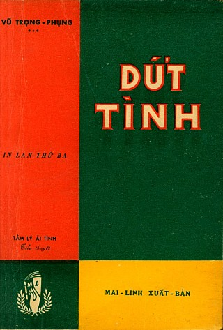

# Dứt tình - Vũ Trọng Phụng



Dứt tình là cuốn tiểu thuyết mang tư tưởng định mệnh siêu hình, được sáng tác năm 1934.

Đọc trực tuyến hoặc tải sách về:

- [Đọc trực tuyến](doc.md)
- [EPUB](ebooks/dut-tinh.epub)
- [AZW3](ebooks/dut-tinh.azw3)

## Tạo EPUB + AZW3

### Chuyển đổi từ Markdown sang EPUB

```
pandoc doc.md -f markdown -t epub -s -o dut-tinh.epub \
	--metadata title="Dứt tình" \
	--metadata author="Vũ Trọng Phụng" \
	--metadata language="vi"
```

### Chuyển đổi từ EPUB sang AZW3

Mình sử dụng `ebook-convert` của Calibre.

```
ebook-convert dut-tinh.epub dut-tinh.azw3
```